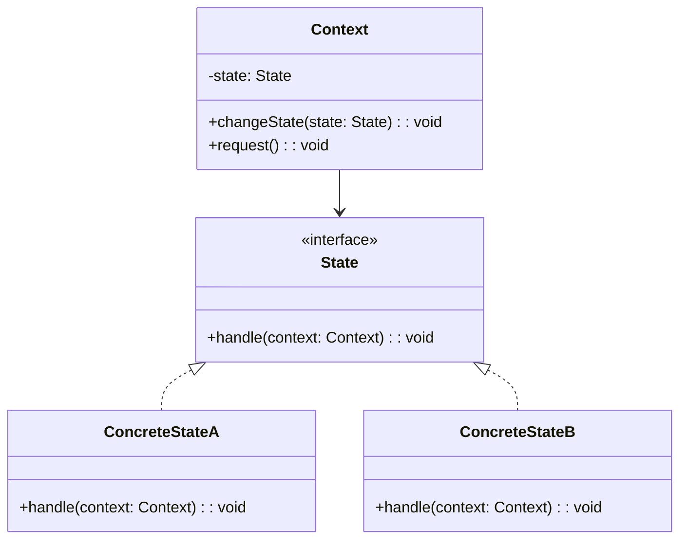

## UML

```mermaid
classDiagram
    class Context {
        -state: State
        +changeState(state: State): void
        +request(): void
    }

    class State {
        <<interface>>
        +handle(context: Context): void
    }

    class ConcreteStateA {
        +handle(context: Context): void
    }

    class ConcreteStateB {
        +handle(context: Context): void
    }

    Context --> State
    State <|.. ConcreteStateA
    State <|.. ConcreteStateB
```

# References
* https://refactoringguru.cn/design-patterns/state
* https://github.com/Sayi/sayi.github.com/issues/70