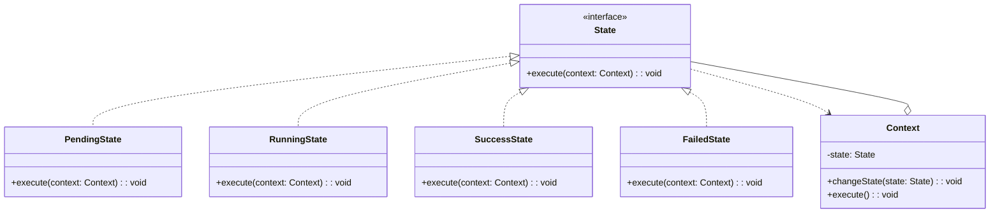

## UML

业务场景:
pending → running → success | failed

# References
* https://refactoringguru.cn/design-patterns/state
* https://github.com/Sayi/sayi.github.com/issues/70
* https://zhuanlan.zhihu.com/p/676913583